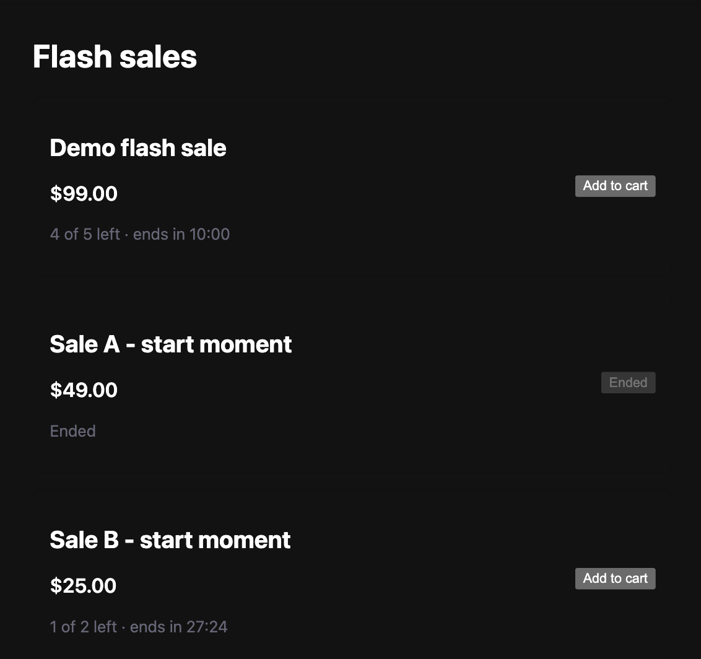
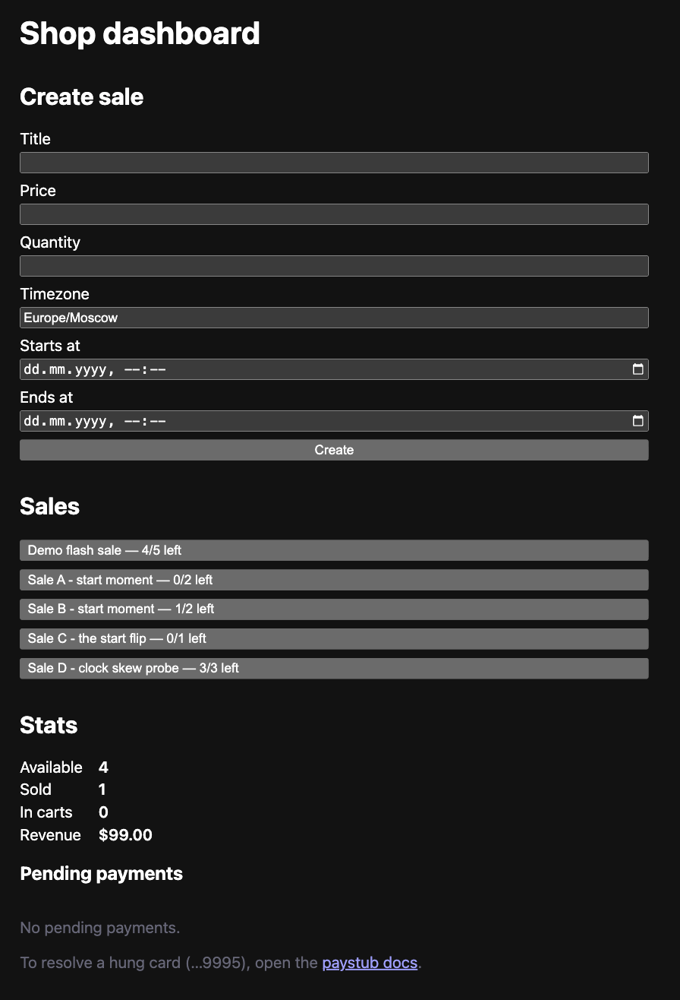
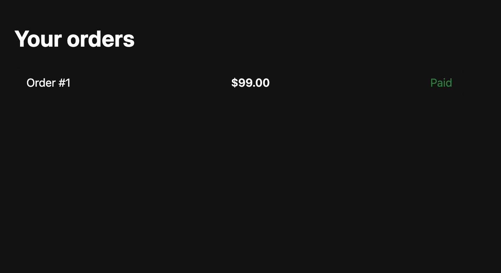

# Проверка в рантайме (2026-09-12)

Прогон собранного приложения целиком: стек поднят из `docker-compose.yml`,
все девять пунктов «Ожидаемое поведение» (`docs/acceptance.md`) и пункт «две
вкладки» проверены через реальные интерфейсы — браузер и HTTP. Тесты проекта в
этой проверке **не** запускались: `make check` не доказывает, что собранное
приложение работает, поэтому здесь только наблюдения за работающим сервисом.

Инструмент: Claude Code (CLI), Claude Opus 5. Отчёт написан по итогам прогона;
исправления найденного лежат в коммитах **после** этого файла.

## Как проверяли

- Стек поднят на портах **18000/18080** вместо 8000/8080: на машине уже были
  заняты оба (`pacer-backend-1` на 8000, `verbatim-frontend` на 8080 — он
  отвечал 200 и его легко принять за фронтенд этого проекта). Перенос host-портов
  сделан оверрейдом compose с тегом `!override`; внутренняя адресация
  (`backend:8000`) не менялась.
- Браузер: две вкладки одного origin (общая cookie-сессия) — витрина, корзина,
  кабинет покупателя, экран магазина.
- `curl` — там, где нужна одновременность (гонки за последнюю единицу, двойная
  оплата) и как третий, не-браузерный клиент SSE.
- Истечение удержания и конец распродажи достигались правкой строк в БД
  (`expires_at`, `ends_at`), а не ожиданием десяти минут. Планировщик при этом
  работал штатно, тик — 1 с.

## Результат по пунктам

| № | Ожидаемое поведение | Что наблюдали | Итог |
|---|---|---|---|
| 1 | До старта купить нельзя; в момент старта открывается у всех | Кнопка `disabled` в обеих вкладках, сервер — `409 sale has not started yet`. Включение — без перезагрузки и без обращения к API | выполнено, с оговоркой (находка 1) |
| 2 | Остатки меняются у всех без обновления страницы | Резерв в 17:07:36.0 → вкладка 1 перезапросила `/sales` в .398, вкладка 2 в .413 | выполнено |
| 3 | Последнюю единицу двум не продать | Одновременный резерв: один `201`, второй `409 sold out`, остаток 1→0 | выполнено |
| 4 | Удержание 10 мин, возврат на витрину, видно сразу | `expires_at` в прошлое → статус `expired`, остаток 1→2, вкладка обновилась через 1.4 с | выполнено |
| 5 | Оплата, начатая до истечения, завершается | Удержание истекло в статусе `paying`, единица не вернулась; поздний вебхук → заказ `paid` | выполнено |
| 6 | Заглушка «зависла» — заказ ждёт, товар не возвращается и не продаётся дважды | Карта `…9995` → `pending`, остаток остался 0; `resolve` → `paid` | выполнено |
| 7 | Двойное нажатие «оплатить» — один заказ, одно списание | Реальный `double_click` → ровно один `POST /orders` и один `POST /pay`. Отдельно: два **одновременных** `POST /pay` в обход UI → `409 payment already in progress` + `200`, одна строка в `payments` | выполнено |
| 8 | Одно письмо о заказе | 4 строки в `notifications`, 4 записи в логе заглушки, `UNIQUE (kind, entity_id)`; одно письмо и после «отказ → повтор» | выполнено |
| 9 | По окончании: корзины очищаются, непроданное снимается, владельцы уведомлены | Удержание → `cleared`, письмо `cart_cleared`, остаток 0, фаза `ended` | выполнено |
| — | Две вкладки синхронны | Обе вкладки: `navigations = 1` за весь прогон | выполнено |

Логи `backend` и `paystub` за весь прогон — без ошибок и трейсбеков.

## Находки

### 1. [средняя] Переключение «старт» — таймер на клиенте; в фоновой вкладке отстаёт
Кнопка открывается вычислением на клиенте: в момент границы **обращения к API
нет вообще**. `StorefrontView.vue` берёт тикающие часы `useTimestamp({ interval: 1000 })`
и вычитает `serverOffset`. В скрытой вкладке Chrome тормозит таймер, и фаза
застывает.

Измерено на отдельной распродаже (Sale E, граница `17:26:03.000Z`):

| Момент | Состояние вкладки |
|---|---|
| 17:26:21.7 (+18.7 с) | всё ещё `disabled`, «Starts in 0:20» |
| 17:26:30.7 (+27.7 с) | включилась, «4 of 4 left» |

Серверный запрет при этом корректен всегда (`409` до границы, `201` после), то
есть купить раньше времени нельзя — расходится только то, что показано в
неактивной вкладке. Латентность в **активной** вкладке не измерялась:
автоматизированный браузер ни разу не отдал `visibilityState: "visible"`.

Сопутствующее наблюдение, тоже проверенное: коррекция расхождения часов
работает. При переводе часов браузера на **+10 минут** карточка продолжала
показывать «Starts in 5:02» и кнопка оставалась выключенной — `serverOffset`
пересчитывается на каждом запросе, поэтому постоянный сдвиг часов покупателя
сокращается.

### 2. [средняя] Созданная распродажа не появляется в уже открытой витрине
Событие о создании не рассылается: `sale_status` публикуется только при
завершении распродажи (`app/scheduler.py`), а `create_sale` не публикует ничего.
Открытая витрина узнаёт о новой распродаже только после перезагрузки. Для
пункта 1 это существенно: сценарий там — «страница открыта заранее».

### 3. [низкая] Отказ карты сохраняет удержание — это не описано
Оплата картой `…0002` оставляет заказ в `pending`, бронь в `held`, единицу — за
покупателем; повтор с `…0000` проходит, писем по-прежнему одно. Поведение
разумное (отказ банка не должен отбирать корзину), но в README его нет.

### 4. [не дефект] Конфликт портов при `make up`
Если 8000/8080 заняты, `make up` падает сырой ошибкой docker о привязке порта.
Это столкновение окружений, а не дефект проекта; отмечено, чтобы следующий
читатель не искал причину в коде.

## Иллюстрации

Витрина: остатки, таймеры, состояние «Ended».

Экран магазина: остатки, продано, в корзинах, выручка и зависшие платежи.

Кабинет покупателя: заказ и его статус.

## Оговорка об инструменте

Во второй половине прогона браузерная автоматизация перестала доставлять
синтетические события клавиатуры и часть кликов (на странице не зафиксировано
ни одного `keydown` при установленном слушателе). Из этого **не** сделано ни
одного вывода о приложении; ранее записанное наблюдение «Enter не отправляет
форму входа» отозвано как артефакт инструмента — в форме есть `<form>` и кнопка
`type="submit"`, проверить нажатие не удалось.
