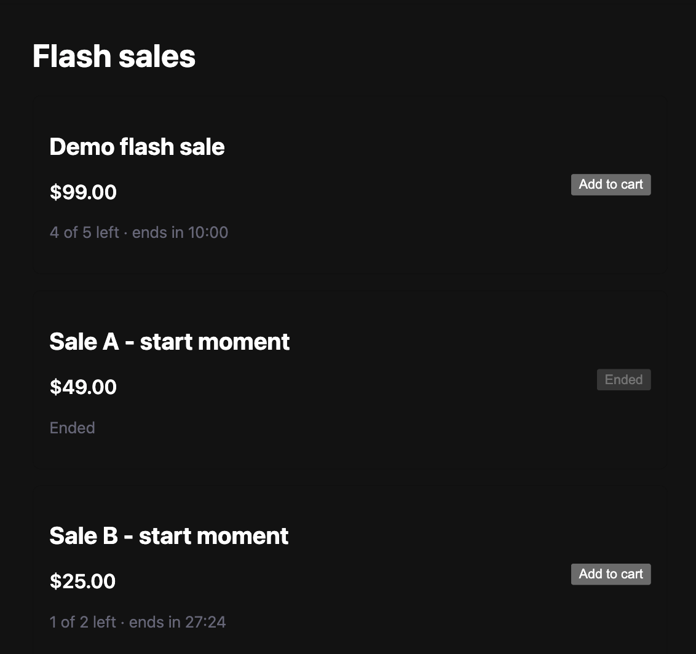
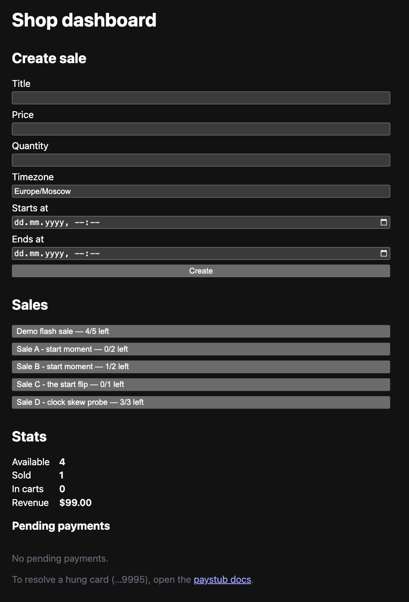
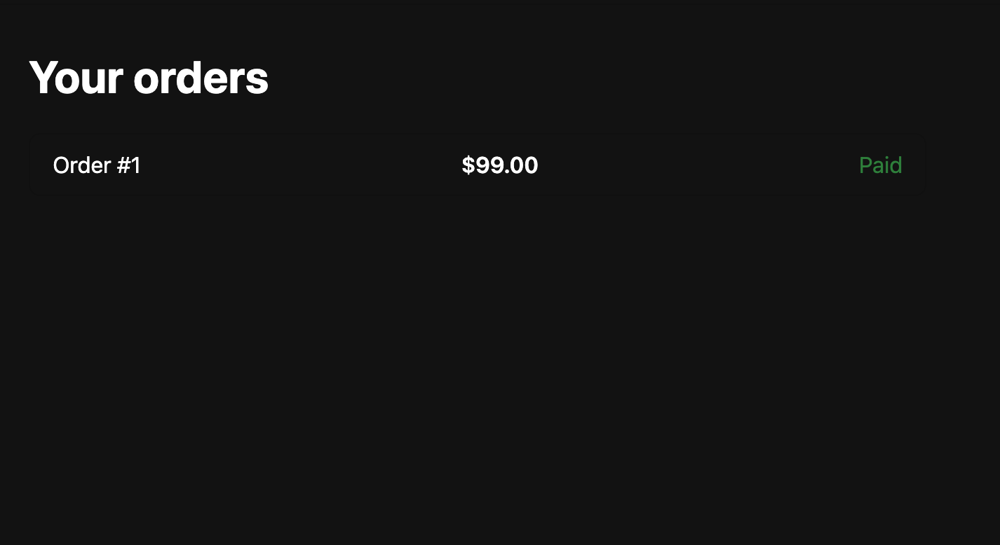

# Runtime verification (2026-09-12)

A run of the whole built application: the stack was brought up from
`docker-compose.yml`, and all nine "Expected behaviour" bullets
(`docs/acceptance.md`) plus the "two tabs" bullet were checked through the real
interfaces — the browser and HTTP. The project's tests were **not** run as part
of this check: `make check` does not prove that the built application works, so
this file holds only observations of the running service.

Tool: Claude Code (CLI), Claude Opus 5. The report was written after the run;
fixes for the findings are in the commits **after** this file.

## How we checked

- The stack ran on ports **18000/18080** instead of 8000/8080: both were already
  taken on the machine (`pacer-backend-1` on 8000, `verbatim-frontend` on 8080 —
  it answered 200 and is easy to mistake for this project's frontend). The host
  ports were moved with a compose override using the `!override` tag; internal
  addressing (`backend:8000`) was not changed.
- Browser: two tabs on the same origin (shared cookie session) — storefront,
  cart, buyer account, shop screen.
- `curl` — where simultaneity was needed (races for the last unit, double
  payment) and as a third, non-browser SSE client.
- Hold expiry and the end of the sale were reached by editing rows in the DB
  (`expires_at`, `ends_at`) rather than waiting ten minutes. The scheduler ran
  normally throughout, with a 1 s tick.

## Results per bullet

| # | Expected behaviour | What we observed | Result |
|---|---|---|---|
| 1 | Cannot buy before the start; at the start it opens for everyone | Button `disabled` in both tabs, server — `409 sale has not started yet`. Enabling happens without a reload and without an API call | done, with a caveat (finding 1) |
| 2 | Stock changes for everyone without a page refresh | Reservation at 17:07:36.0 → tab 1 refetched `/sales` at .398, tab 2 at .413 | done |
| 3 | The last unit cannot be sold to two buyers | Simultaneous reservation: one `201`, the other `409 sold out`, stock 1→0 | done |
| 4 | Hold of 10 min, return to the storefront, visible immediately | `expires_at` moved into the past → status `expired`, stock 1→2, the tab updated after 1.4 s | done |
| 5 | A payment started before expiry completes | The hold expired in status `paying`, the unit was not returned; a late webhook → order `paid` | done |
| 6 | The stub "hung" — the order waits, the item is neither returned nor sold twice | Card `…9995` → `pending`, stock stayed at 0; `resolve` → `paid` | done |
| 7 | Double click on "pay" — one order, one charge | A real `double_click` → exactly one `POST /orders` and one `POST /pay`. Separately: two **simultaneous** `POST /pay` bypassing the UI → `409 payment already in progress` + `200`, one row in `payments` | done |
| 8 | One email per order | 4 rows in `notifications`, 4 entries in the stub's log, `UNIQUE (kind, entity_id)`; still one email after "decline → retry" | done |
| 9 | At the end: carts are cleared, unsold stock is withdrawn, owners are notified | Hold → `cleared`, email `cart_cleared`, stock 0, phase `ended` | done |
| — | Two tabs stay in sync | Both tabs: `navigations = 1` for the whole run | done |

The `backend` and `paystub` logs for the whole run — no errors and no tracebacks.

## Findings

### 1. [medium] The "start" switch is a client-side timer; it lags in a background tab
The button is enabled by a client-side computation: at the boundary **there is
no API call at all**. `StorefrontView.vue` takes the ticking clock
`useTimestamp({ interval: 1000 })` and subtracts `serverOffset`. In a hidden tab
Chrome throttles the timer, and the phase freezes.

Measured on a separate sale (Sale E, boundary `17:26:03.000Z`):

| Moment | Tab state |
|---|---|
| 17:26:21.7 (+18.7 s) | still `disabled`, "Starts in 0:20" |
| 17:26:30.7 (+27.7 s) | enabled, "4 of 4 left" |

The server-side block is always correct (`409` before the boundary, `201`
after), so buying early is impossible — only what an inactive tab shows is out
of step. Latency in an **active** tab was not measured: the automated browser
never once reported `visibilityState: "visible"`.

A related observation, also verified: clock-skew correction works. With the
browser clock set **+10 minutes** ahead, the card kept showing "Starts in 5:02"
and the button stayed disabled — `serverOffset` is recomputed on every request,
so a constant skew in the buyer's clock cancels out.

### 2. [medium] A newly created sale does not appear in an already open storefront
No creation event is broadcast: `sale_status` is published only when a sale
ends (`app/scheduler.py`), and `create_sale` publishes nothing. An open
storefront learns about a new sale only after a reload. For bullet 1 this
matters: the scenario there is "the page is open in advance".

### 3. [low] A card decline keeps the hold — this is not documented
Paying with card `…0002` leaves the order in `pending`, the hold in `held`, and
the unit with the buyer; a retry with `…0000` goes through, and there is still
one email. The behaviour is sensible (a bank decline should not take the cart
away), but README does not mention it.

### 4. [not a defect] Port conflict on `make up`
If 8000/8080 are taken, `make up` fails with a raw docker port-binding error.
This is an environment clash, not a project defect; noted so the next reader
does not look for the cause in the code.

## Illustrations

Storefront: stock, timers, the "Ended" state.

Shop screen: stock, sold, in carts, revenue and stuck payments.

Buyer account: an order and its status.

## Tool caveat

In the second half of the run the browser automation stopped delivering
synthetic keyboard events and some clicks (the page recorded not a single
`keydown` with a listener attached). **No** conclusion about the application
was drawn from this; an earlier observation, "Enter does not submit the login
form", was withdrawn as a tool artifact — the form has a `<form>` and a
`type="submit"` button, but the key press could not be verified.
